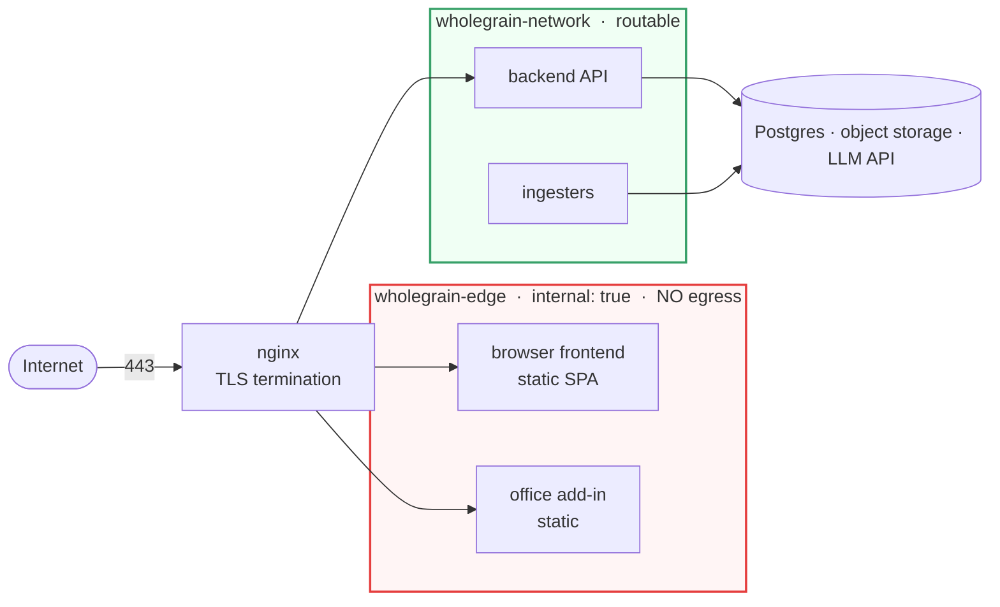

<p align="center">
  
</p>

<h1 align="center">Wholegrain Finance — Investment Ontology</h1>

**An open-source data model and toolkit for investment holdings, funds and family offices.**

Most portfolio tooling is either a spreadsheet that eventually collapses under its own
weight, or a closed platform that decides for you what an "investment" is. Wholegrain is
the middle path: a small, explicit ontology you run on your own infrastructure, with
modules you add only if you need them.

The ontology is the product. Everything else — extraction, search, agents, reporting — is
a module that reads and writes these four tables.

---

## The ontology

Four tables carry the whole domain. Every module reads and writes these; nothing else is
load-bearing.

```
entities ──────subject/object── transactions ──event_id── events
       │                                                      │
       └──────────────── measurements ────────────────────────┘
```

### `entities`

Every party, asset and account is a row here — the thing you own, the thing you owe, the
counterparty you pay, and the bank account the money sits in.

Not `legal_entities`: a bank account, a property and a loan balance are none of them
legal persons, and accounts are the most trafficked rows of all — every bank
transaction names one as its subject. The table holds whatever a transaction can
point at; `type` and `structure_type` say what each one is.

| `type` | |
|---|---|
| `private_company` | operating company, unlisted |
| `listed_equity` | listed position |
| `fund` | fund interest (LP position) |
| `real_estate_fund` | property fund |
| `real_estate` | direct property |
| `spv` | special-purpose vehicle |
| `crypto_asset` | digital asset |
| `cash_account` | a bank or custody account |
| `payable_receivable` | a loan, mortgage or intra-group balance |
| `service_provider` | lawyers, auditors, agents |
| `individual` | a natural person |

`structure_type` is orthogonal and has exactly two values: **`holding`** (a vehicle you
own things *through*) and **`asset`** (a thing you own).

> **Model bank accounts as entities.** A cash account is a first-class `entities` row, not
> a field on a transaction. That is what lets a payment name *which* account it moved on,
> and lets you reconcile per account against a statement.

### `events`

The economic thing that happened. One event can own several transactions — that is how a
single investment ties its cash leg to its share leg.

`investment` · `divestment` · `capital_call` · `distribution` · `exit` ·
`commitment` · `valuation` · `reporting` · `governance` · `financing_round` ·
`news` · `general_information` · `other`

`exit` is the *company's* liquidity event — trade sale, IPO, the whole cap table
exits together. `divestment` is *you* selling out of a position that continues
without you. Likewise `financing_round` is the company's event and `investment`
is your participation in it: one round can carry several of your investments
across vehicles.

`news` and `general_information` carry no money and no transactions.

### `transactions`

**A transaction is an exchange, not a cashbook line.** This is the part most models get
wrong, so it is worth stating plainly.

Each transaction has two legs. Each leg says *how much* and *of what unit*:

```
outflow_amount / outflow_type / outflow_reporting_amount   ← what was given
inflow_amount  / inflow_type  / inflow_reporting_amount    ← what was received
```

`*_type` is a **unit**, not a currency. `EUR` means euros. `equity` means shares. So:

| | outflow | inflow |
|---|---|---|
| Paying a law firm €56.88 | `56.88 EUR` | `service` *(no amount — a service has none)* |
| Buying shares for $199,968 | `199968.03 USD` | `5758 equity` *(5,758 shares)* |
| Capital call €43,269 | `43269.92 EUR` | `fund_interest` |
| FX transfer between own accounts | `50000 EUR` | `47800 CHF` |

`*_reporting_amount` is the same leg normalised to your reporting currency. It is null on
a leg that has no monetary value, such as shares or a service.

`type` records **why**, not **how**:

`investment` · `divestment` · `capital_call` · `distribution` · `exit` ·
`commitment` · `invoice` · `fee` · `dividend` · `interest` · `transfer` ·
`conversion` · `other`

The payment rail (wire, SEPA, card) belongs in `add_data.rail`; a firm's own
label belongs in `classification`.

**A transaction is an exchange — if nothing changes hands it is not one.** That is
why there is no `write_off` and no `valuation`: an asset going to zero moves no
money, so it is a `fair_value` measurement with a `valuation` event.
`conversion` stays for the opposite reason — a SAFE converting to equity gives up
the note and receives shares.

**Units.** A leg is measured in an ISO-4217 currency, or in an instrument:

| | |
|---|---|
| equity | `common` `preferred` `series_seed` `series_a` `series_a1` … |
| derivative | `safe` `convertible_note` `warrant` `option` |
| fund | `fund_interest` `carry_interest` |
| other | `loan` `crypto` `service` `cash` `other` |

Equity classes stay **granular on purpose**: liquidation seniority is by class, so
collapsing them to one `equity` value would make a waterfall uncomputable. Class
gives the default ordering only — the negotiated terms (multiple, participating,
explicit rank, pari passu peers) are per deal and live in `add_data.liq_pref`.

`capital_account` is deliberately *not* a unit: it is the balance of a fund
position, not a thing that changes hands. The position is `fund_interest`; its
balance is a measurement.

### `measurements`

Periodic numeric facts about an entity — a company KPI, or a valuation of an instrument.

`fair_value` · `cost_basis` · `ownership_pct` · `shares` · `price_per_share` ·
`committed_capital` · `called_capital` · `capital_account_value` · `revenue` · `ebitda` ·
`gross_margin` · `arr` · `runway` · `headcount` · `cash`

---

## Extending it

Two escape hatches, so you never have to fork the schema:

- **`add_data`** — a `jsonb` column on every table. Firm-specific facts live here: value
  dates, wire references, FX rates, the verbatim source row. Promote a key to a real
  column once you filter on it constantly.
- **Modules** — anything that reads the four tables. Add only what you need.

**Keep your own vocabulary out of the shared `type` fields.** Use `classification` or
`add_data` for firm-specific labels. Folding them into `type` is how a taxonomy quietly
drifts until reporting across entities stops working.

---

## Modules

| Module | Does |
|---|---|
| **API** | REST over the ontology, auth, workspace isolation |
| **Frontend** | Ledger views, search, dashboards |
| **nginx** | TLS termination and reverse proxy |
| Lightweight extraction | Text-native documents (PDF text layer, Office, email) — in-house |
| Search | Hybrid lexical + vector retrieval over extracted text |
| Agents | Propose rows from documents for human review |

**OCR and heavy document extraction are deliberately a separate module.** They need GPUs
or a paid API, they are the least portable part of any such system, and most holdings
never require them. The in-house extractor handles text-native documents only. Bring your
own OCR if you need scans.


### Network topology

Static frontends get **no route to the internet**. They serve files; the browser
talks to the API directly, so the container itself never needs egress.



nginx is the only member of both networks, so it must be started first — it
creates the edge network that the frontends then join as `external: true`.

Why bother: a static container that cannot make outbound connections cannot
fetch a payload. A compromise on this host used outbound HTTP to pull a
cryptominer and reach a mining pool; on an `internal: true` network both steps
fail, which turns a foothold into a dead end rather than merely a smaller one.
`internal: true` still permits Docker's embedded DNS and traffic between members,
so nginx reaches the frontends normally. It does not permit published host ports:
Docker configures no gateway on an internal network, so a `ports:` mapping on a
member silently does nothing — those containers are reachable only through nginx.

---

## Requirements

- A cloud account (or your own hardware)
- A VM — 2 vCPU is enough to start; more RAM if you build frontends on the same box
- Managed PostgreSQL
- Managed object storage
- An LLM API key, for the optional agent and labelling modules

## Install

1. Clone the modules you want: **API**, **frontend**, **nginx**
2. Provision managed PostgreSQL
3. Provision managed object storage (blob/S3)
4. Obtain an LLM API key, if using the agent modules
5. Fill in the `.env` files for each module
6. `docker compose up -d`
7. Apply the hardening below — do not skip it

## Hardening

- **Lock the database to known addresses.** No public firewall rule, no
  "allow all cloud services" — on most providers that admits *every* customer, not just
  you. Prefer a private endpoint.
- **Terminate HTTPS properly** and redirect all plain HTTP.
- **Put a WAF or CDN in front** (cloud front door, Cloudflare) to absorb brute-force and
  bot traffic before it reaches your VM.
- **Keep compute and database in the same region.** A cross-region split adds ~100 ms to
  every query and will dominate your latency budget long before your hardware does.
- **Put static frontends on an egress-free network** — see
  [Network topology](#network-topology). A container that serves files needs no
  outbound access, and denying it turns a compromise into a dead end.
- Keep admin access on a VPN or bastion; do not expose management ports.

---

## Reference

- **[DATABASE.md](DATABASE.md)** — the schema in full: tables, relationships,
  row-level security, search internals, index costs and known warts.
- **[SECURITY.md](SECURITY.md)** — what the shipped configuration hardens, what
  it deliberately does not, and why each control exists.

## Status

Early. The ontology is in production use; the docs here describe the model rather than a
packaged release. Issues and discussion welcome.

## License

To be decided before the first module is published — likely Apache 2.0.
